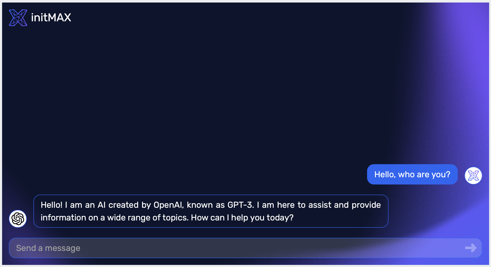
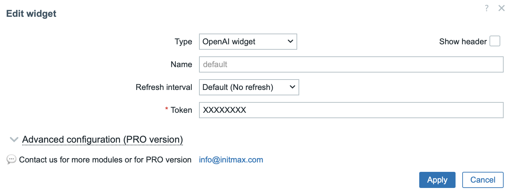

# Zabbix ChatGPT widget

## Description

This is a Zabbix widget using ChatGPT bot, which responds accordingly to the standard OpenAI requests.

Deme examle https://www.initmax.cz/zabbix/zabbix.php?action=dashboard.view&dashboardid=56&page=10 (Login as Quest)

## Widget

## Configuration popup

## Requirements
 - Zabbix 7.0 (still in development, so this module will be updated accordingly)
 - You need to create OpenAI API token https://platform.openai.com/docs/introduction/overview

## Setup

1\. Clone repository into the `ui/modules/` folder (standard path is `/usr/share/zabbix/modules/`)

2\. Change the owner of directory to your web user with `chown`

3\. Go to Menu -> Administration -> General -> Modules

4\. Use the Scan directory button on the top

5\. Enable the module

6\. Use it and enjoy!

## Zabbix configuration

No specific Zabbix configuration is required.

### Macros used

No macros in use.

---
**Like, share and follow us** 😍 for more content:
- [LinkedIn](https://www.linkedin.com/company/initmax/)🔥
- [Twitter](https://twitter.com/initmax)
- [Instagram](https://www.instagram.com/initmax/)
- [Facebook](https://www.facebook.com/initmax)
- [Web](https://www.initmax.cz/)
- [Youtube](https://www.youtube.com/@initmax1)
